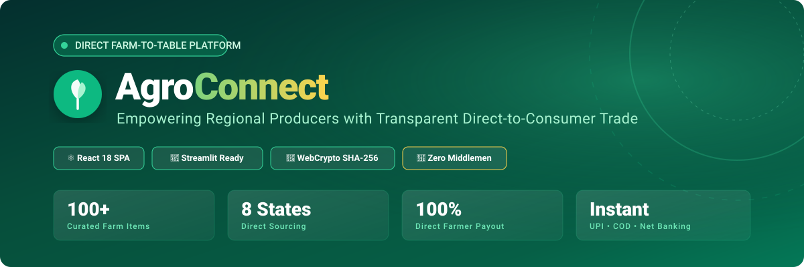
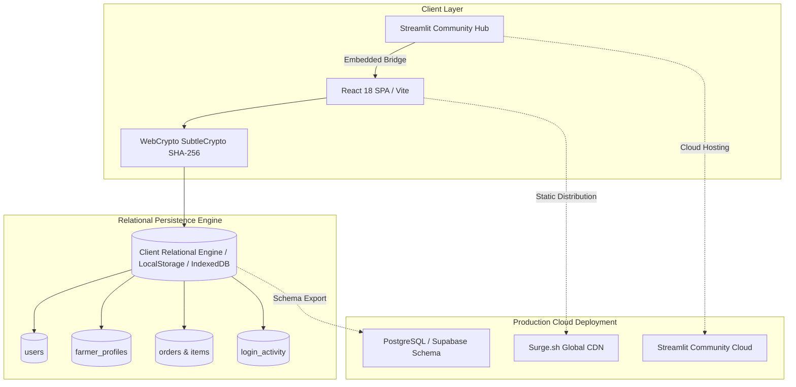

<div align="center">

  

  <br />

  <p align="center">
    <a href="https://agroconnect-marketplace.surge.sh"></a>
    <a href="https://share.streamlit.io/deploy?repository=LALI20006/Farmer&branch=master&mainModule=streamlit_app.py"></a>
    <a href="https://github.com/LALI20006/Farmer"></a>
    <a href="https://developer.mozilla.org/en-US/docs/Web/API/Web_Crypto_API"></a>
  </p>

  <p align="center">
    <strong>Direct Farm-to-Table Agricultural Marketplace & Traceability Platform</strong><br />
    <em>Bridging Regional Indian Farmers Directly with Consumers • Zero Middlemen • 100% Farm Traceability • Fair Value Payouts</em>
  </p>

  <p align="center">
    <a href="https://agroconnect-marketplace.surge.sh"><b>🚀 Launch Live App</b></a> •
    <a href="https://share.streamlit.io/deploy?repository=LALI20006/Farmer&branch=master&mainModule=streamlit_app.py"><b>⚡ 1-Click Streamlit Deploy</b></a> •
    <a href="#-demo-credentials"><b>🔑 Demo Credentials</b></a> •
    <a href="#-architecture--data-pipeline"><b>🏛️ Architecture</b></a> •
    <a href="#-local-development"><b>💻 Quickstart</b></a>
  </p>

</div>

---

## 🌟 Executive Overview

**AgroConnect** is a modern, high-performance agricultural marketplace ecosystem engineered to eradicate multi-tier middleman exploitation in the agricultural supply chain. By directly connecting verified regional farmers with household buyers and bulk purchasers across India, AgroConnect provides:

- 🌾 **Direct Farm-to-Fork Traceability**: Every crop batch displays verified farmer profiles, district/state origins, harvest dates, and organic certifications.
- 💰 **100% Direct Farmer Realization**: Transparent, fair pricing where farmers set their rates and receive full compensation with 0% intermediary commission.
- 🔐 **Zero-Knowledge WebCrypto Security**: Passwords are never stored in plaintext; salted SHA-256 cryptographic hashing executes client-side via native `window.crypto.subtle`.
- ⚡ **Multi-Target Deployment**: Ships simultaneously as a blazingly fast React 18 SPA on static edge CDNs and as an interactive Python **Streamlit Community Cloud** application.

---

## 🧭 Live Deployments

| Channel | Platform | Access Link | Status |
| :--- | :--- | :--- | :--- |
| **Primary Production SPA** | **Surge.sh (Global Edge CDN)** | [https://agroconnect-marketplace.surge.sh](https://agroconnect-marketplace.surge.sh) | `🟢 Operational` |
| **Streamlit Cloud Hub** | **Streamlit Community Cloud** | [1-Click Streamlit Deployment](https://share.streamlit.io/deploy?repository=LALI20006/Farmer&branch=master&mainModule=streamlit_app.py) | `🚀 Ready to Deploy` |
| **Source Code Repository** | **GitHub** | [github.com/LALI20006/Farmer](https://github.com/LALI20006/Farmer) | `📦 Public` |

---

## 🔑 Demo Credentials

Test the platform instantly across all user roles or create new accounts on the registration page:

| Portal Role | Demo Login Identifier | Password | Access Rights & Privileges |
| :--- | :--- | :--- | :--- |
| **🛡️ System Administrator** | `admin@agroconnect.in` | `admin123` | Full governance: User Directory, Account Activation/Banning, Live Login Audit Trail |
| **🚜 Verified Producer (Farmer)** | *Create in Register Page* | *Your Password* | Producer Hub: Add Harvests, Update Inventory Pricing, Order Fulfillment Pipeline |
| **🛒 Consumer (Buyer)** | *Create in Register Page* | *Your Password* | Buyer Hub: 100+ Crops, Side-Drawer Cart, Instant UPI/COD Checkout, Order Tracking |

---

## 🎯 Role Portals & Core Capabilities

### 1. 🛒 Consumer & Buyer Experience
- **100+ Curated Products**: Spanning 8 categories (Fresh Vegetables, Fruits, Heirloom Grains, Pulses, Desi Dals, Spices, Dairy, and Farm Supplies).
- **Multi-Dimensional Filters**: Instant filtering by Indian State/Region (Andhra Pradesh, Punjab, Kerala, Maharashtra, Himachal Pradesh, etc.), organic certification, price range, and star rating.
- **Product Traceability**: Detailed batch cards disclosing harvest validity dates, farm location, producer story, and farming methodologies (ZBNF, Vedic, Chemical-Free).
- **Streamlined Cart & Checkout**: Slide-out cart drawer, dynamic delivery calculations, and flexible payments:
  - 💵 Cash on Delivery (COD)
  - 📱 UPI / Instant QR Payment
  - 🏦 Net Banking
  - 💳 Credit & Debit Cards
- **Order Lifecycle Tracking**: Live status tracking (*Confirmed* ➔ *Processing* ➔ *Shipped* ➔ *Delivered*).
- **In-App Farmer Messaging**: Real-time modal for buyers to chat directly with farmers regarding bulk inquiries and crop quality.

### 2. 🚜 Farmer Producer Portal
- **Telemetry Dashboard**: Live revenue metrics, total units dispatched, active customer orders count, and inventory stock monitoring.
- **Catalog Management**: Add new agricultural produce with custom pricing per kg, unit quantities, organic badges, and harvest dates.
- **Order Fulfillment Pipeline**: Manage incoming buyer orders and toggle real-time fulfillment statuses (*Processing* ➔ *Dispatched* ➔ *Completed*).
- **Farmer Profile Showcases**: Public farm profiles showing farm acreage, soil health certificates, awards, and direct customer contact channels.

### 3. 🛡️ Administrator & Governance Portal
- **User Directory & Account Governance**: Search and filter all registered users (Customers, Farmers, Admins) and activate or deactivate accounts with real-time state synchronization.
- **Session Audit & Security Logs**: Comprehensive security trail recording every authentication event, user ID, role, session timestamps, and termination state.
- **Inquiry Management**: Centralized feedback and dispute inbox.

---

## 🏛️ Architecture & Data Pipeline



---

## 🛠️ Technology Stack Matrix

| Domain | Technology | Version | Purpose |
| :--- | :--- | :--- | :--- |
| **Frontend Framework** | **React** | `18.3.1` | Component-driven UI architecture and declarative state hooks |
| **Build Engine** | **Vite** | `5.4.6` | Next-generation ESM dev server and optimized Rollup bundler |
| **Styling** | **Tailwind CSS** | `3.4.13` | Custom emerald/earth palette tailored for modern agricultural UX |
| **Iconography** | **Lucide React** | `0.453.0` | Crisp, accessible SVG icons |
| **Security & Auth** | **Web Crypto API** | Native | 16-byte random salt generation & SHA-256 cryptographic hashing |
| **Python Cloud Layer** | **Streamlit** | `1.35.0+` | Cloud hosting bridge and interactive data telemetry hub |
| **Relational Database** | **IndexedDB / SQL** | ANSI SQL | In-browser relational engine + production `database/schema.sql` |
| **Static Edge Hosting** | **Surge.sh** | Global | Production edge distribution with `200.html` SPA routing |

---

## 💻 Local Development & Quickstart

### Prerequisites
- **Node.js**: `v18.0.0+`
- **Python**: `v3.9+` *(optional, for Streamlit)*
- **npm** or **pnpm** / **yarn**

### 1. Clone & Install Dependencies
```bash
git clone https://github.com/LALI20006/Farmer.git
cd Farmer
npm install
```

### 2. Start the Vite React Development Server
```bash
npm run dev
```
The application will be live at `http://localhost:5173`.

### 3. Run the Streamlit Application Locally
```bash
# Setup Python virtual environment
python -m venv .venv
.venv\Scripts\pip install -r requirements.txt

# Launch Streamlit server
.venv\Scripts\streamlit run streamlit_app.py
# Or via npm shortcut:
npm run streamlit
```
The Streamlit interface will open at `http://localhost:8501`.

---

## 🚀 1-Click Streamlit Cloud Deployment Guide

1. Ensure the latest code is pushed to your repository:
   ```bash
   git push origin master
   ```
2. Click the pre-filled deployment link:
   👉 **[Deploy to Streamlit Community Cloud](https://share.streamlit.io/deploy?repository=LALI20006/Farmer&branch=master&mainModule=streamlit_app.py)**
3. Confirm settings:
   - **Repository**: `LALI20006/Farmer`
   - **Branch**: `master`
   - **Main file path**: `streamlit_app.py`
4. Click **Deploy!**. Streamlit Cloud will handle building and provisioning your live application.

---

## 📄 License & Attribution

Distributed under the **MIT License**. Engineered with ❤️ for India's farming communities.
